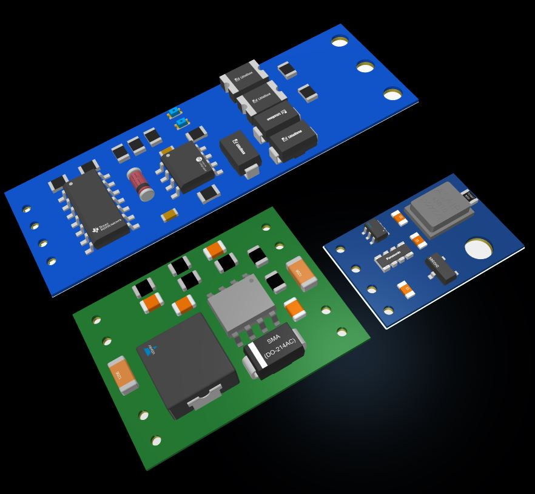

## altium-librarys

In this repository, I will place the 3D libraries and footprints that I have designed.
Currently, the following components are placed in the repository:

- SCM TTL to RS485 Interface Module (Two-way Converter)
- MP1584 DC-DC step down module
- AHT10 Digital Temperature & Humidity Sensor Module.

modules

